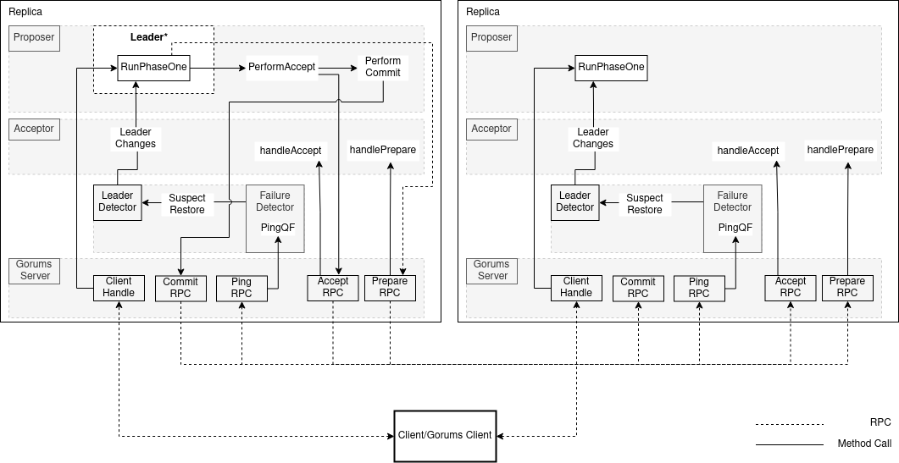

# Multi-Paxos with Gorums

## Background and Resources

This assignment extends the Multi-Paxos implementation in lab 4.
The previous assignment focused on protocol understanding.
However, real communication among the replicas was not specified and implemented in lab 4.

In this assignment, you will extend the replica communication mechanism using [Gorums][1].
Gorums provide the necessary infrastructure for replicas to initiate and respond to the RPCs.
It also provides the necessary abstraction to develop quorum-based operations.
You must use these tools to develop a deployable Multi-Paxos protocol.

## Task Description

You need to implement Multi-Paxos on gorums with failure detector.
You can reuse a significant part of the implementation in lab4 and lab3.
The skeleton code, unit tests and definitions for this assignment can be found in the `gorumspaxos` package.
The implementation of the Multi-Paxos with gorums is divided into the following files:

### Replica (replica.go)

  This file defines `PaxosReplica`, the base structure which contains the `proposer`, `acceptor` and uses a `failure detector`.
  It handles all the `MultiPaxos` service RPCs and invoke the relevant methods of the `proposer` or `acceptor`.
  Most of the methods are already given to you, go through their implementation and understand their purpose.
  You are requested to complete the following two methods:

  * `ServerStart()`: this method invokes the `Start()` method of the proposer.
    It starts the gorums server and register the MultiPaxos service.
    You should pass the created gorums server to start the failure detector, and make sure that the `Serve`  method of the gorums server was called, to wait for connections.

  * `getResponse()`: this method is called after adding the client request to the proposer queue.
    All the committed requests are added to the `responseList` by the `Commit()` method.
    This function waits on the `responseList` for the response matching the request.
    This can be implemented by creating a new go routine and making it repeatedly check the `responseList` for the matched response after time intervals.
    If a response is not present within the maximum `waitTimeForPhaseTwo` time, clean up the created goroutine and return an error.

### Proposer (proposer.go)

  This file defines the `Proposer` structure, which contains the variables for the proposer implementation.
  A proposer may be selected as the Leader of the Multi-paxos protocol.
  The leader is responsible for creating the gorums configuration containing all replicas.
  The Consensus protocol is implemented by calling the RPCs on the configuration.
  The Multi-Paxos protocol determines the sequence of the RPCs as shown in the [architecture diagram](#gorums-multi-paxos-architecture).

  Proposers subscribe to the leader detector and receive updates about the leader changes.
  If a replica is selected as the leader then that replica is responsible for conducting the protocol.
  Hence, the proposer should check for the events of leader change before moving to the next phase in the protocol.
  Some of the methods in the [proposer.go](proposer.go) are already implemented. The ones marked with `TODO(student)` are for you to complete the implementation.
  You need to complete the following methods:

  * `runPhaseOne()`: this method implements the phase one of the Multi-Paxos protocol.
    This function should be called only if the replica is the leader and phase one is not already completed.
    You should create the configuration with all the replicas by calling the `createConfiguration()` method.
    Then, create a `PrepareMsg` message with the current round `Id` and incremented `aduSlotId`, sending this message to all replicas by making a quorum call on the configuration.
    If the prepare quorum call succeeded, set `phaseOneDone` to true and `nextOperation` to "accept".
    If the reply sent from the quorum call contains the promise slots, add them to the accept queue.

  * `Start()`: this method creates a new goroutine that should start an infinite loop to select on the following events:
    - Wait on the *status channel* to conduct the paxos phases and operations. If no error status is received, then move to the next operation in the protocol, otherwise retry.
    - Wait for subscribed leader change events. If a replica becomes leader due to a leader change event from the leader detector, then the proposer should updates `p.leader`, starts a new phase one, and resets the `phaseOneDone` flag and `acceptMsgQueue` and `clientRequestQueue` queues. It should also set the next operation to `Prepare`.
    - Wait on stop channel to stop the replica. Exit from the goroutine and close the gorums server.
    - By default, check for the presence of any pending requests from a client. If `clientRequestQueue` queue is not empty, call `runMultiPaxos` to execute the request.

  * `performAccept()`: this method performs the accept phase of the Multi-Paxos.
    The `acceptReqQueue` contains the accept requests added after the Prepare phase.
    This queue has a higher preference than client requests added to `clientRequestQueue`, so you should handle it before the client request queue.
    Requests from the `clientRequestQueue` are processed only after the `acceptReqQueue` is empty.
    If there is an accept request message in any of the queues, you should add the accept message to the incremented next slot Id and current round.
    After creating the proper accept message, you must call the `Accept()` RPC on the configuration to collect learn messages and verify the replies in the `quorumspec`.
    If a valid reply is received from the quorum call, you should store the response in `learnMsg` and move to the next operation by calling the `sendStatus()` method.

  * `performCommit()`: this method performs the commit phase of the Multi-Paxos.
    You should use the `learnMsg` field in the `Proposer` struct to prepare a learn message and calls the `Commit()` quorum call on the configuration.

  * `createConfiguration()`: this method creates the configuration to make the quorum calls.
    You should use the `manager` field in the `Proposer` struct to create a configuration with the quorum spec implementation and the `NodeMap` provided to the Proposer constructor.
    On successful creation of the configuration, assign the configuration to the config field in the `Proposer` struct.

### Qspecs (qspecs.go)

  This file implements the quorum functions used in the Multi-Paxos protocol.
  The `PaxosQSpec` must be initialized with the quorum size when creating a new `PaxosQSpec`.
  You need to implement all the quorum functions.
  All quorum functions should check if the received replies are valid (i.e. there is quorum of replies).
  Only valid replies should be considered for quorum calculations.
  If a valid quorum of replies is received, then the quorum functions should return the proper reply (the type of this message varies per function) and `true`, otherwise it should return `nil` and `false`.
  You need to implement the following methods:

  * `PrepareQF()`: is the quorum function for the `Prepare()` RPC.
    It should validate all the received replies.
    If it receives a quorum of valid replies from the acceptors then prepare a reply with the promise slots in the increasing order of slot IDs.
    You can check the implementation of this method running the test below:

    ```sh
    go test  -run TestHandlePrepareQF
    ```

  * `AcceptQF()` is the quorum function for the `Accept()` RPC.
    Check the validity of the learn messages in the replies.
    If a valid quorum of learn messages is received, return a learn message with `true`.
    You can check the implementation of this method running the test below:

    ```sh
    go test  -run TestHandleAcceptQF
    ```

  * `CommitQF()`: is the quorum function for the `Commit()` RPC.
    If a quorum of replies is received, it returns an empty message (i.e. `*pb.Empty`) and `true`, otherwise it returns `nil` and `false`.
    You can check the implementation of this method running the test below:

    ```sh
    go test  -run TestHandleCommitQF
    ```

  * `ClientHandleQF()`: is the quorum function for the `ClientHandle()` RPC.
    The `ClientHandle()` RPC is executed by the client to send the request to the replicas, and this quorum function waits for the correct replies from a quorum of replicas.
    After receiving the correct replies from the quorum of replicas, it returns the reply to the client.
    You can check the implementation of this method running the test below:

    ```sh
    go test  -run TestHandleClientReqQF
    ```

### Acceptor (acceptor.go)

  This file implements the acceptor role of a Paxos replica.
  It handles the `Prepare()` and `Accept()` RPCs from a proposer.
  You need to implement the following methods:

  * `handlePrepare()`: this method processes `PrepareMsg` messages according to the Multi-Paxos algorithm.
    This function should return a promise (i.e. `PromiseMsg`) message if the rules of the protocol are satisfied or `nil` otherwise (similar as in lab4 but only returning one value).

  * `handleAccept()`: this method processes `AcceptMsg` messages according to the Multi-Paxos algorithm.
    This function should return a learn (i.e. `LearnMsg`) message if the rules of the protocol are satisfied or `nil` otherwise (similar as in lab4 but only returning one value).

  * You can check the implementation of the above two methods in acceptor running the test below:

    ```sh
    go test  -run TestMPHandlePrepareAndAccept
    ```

### Failuredetector (gorumsfd/failuredetector.go)

  This file implements the failure detector of lab3 using gorums.
  All the replicas send heartbeat to each other to identify the live replicas.
  After identifying the suspected fault replicas, it informs the leader detector about those faulty nodes by calling the `Suspect` method.
  If a replica received a heartbeat reply from a previously suspected node then it informs to the leader detector by calling the `Restore` method.
  You need to implement the following functions:

  * `StartFailureDetector()`: This method registers the failure detector server implementation using `pb.RegisterFailureDetectorServer` and starts the loop to periodically perform the failure detection.
    After registering the server implementation, it starts a goroutine that executes two tasks in a infinite loop:
    - Calls `PerformFailureDetection` every `e.delay` seconds to perform the failure detection.
    - Waits for any message on the `stop` channel to break the loop and stop the failure detector.

  * `PerformFailureDetection()`: This method performs the failure detection by creating a configuration with all the replicas and call the `Ping` RPC on the configuration.
    You should check if a configuration is already created or create a new configuration using the `manager`, with all the replicas which are present in the node map.
    Then store the configuration in the `EvtFailureDetector` struct, and
    make a `Ping` RPC call on the configuration with a timeout context of `e.delay` seconds.
    Finally, call `SendStatusOfNodes` to notify the new status of the nodes to the leader detector.

  * `SendStatusOfNodes()`: This method sends the status of the replicas to the leader detector using the `Suspect` and `Restore` methods.
    It follows the rules described below. You can utilise the `alive` and `suspected` maps to achieve the functionality and reset the `alive` map at the end of the method.
      - If a previously suspected node is marked alive in the `PingQF` then `e.delay` should be increased by `e.delta`.
      - If a replica is not previously suspected and there is no reply to the `Ping` RPC from that replica then mark the node as suspected and call `Suspect` method of the leader detector with that node id.
      - If a previously suspected replica now replies to the `Ping` RPC then mark the node as Restored and call `Restore` method of the leader detector with that node id.

  * `PingQF`: is the quorum function to the `Ping` RPC.
    A replica is marked alive if a reply is received from it.
    You must return a reply and `true` if all the replicas sent the replies otherwise return `nil`, `false`.

  * You can check some of the failure detector functionality using the following test:

    ```sh
    go test  -run TestFDPerformFailureDetection
    ```

## Gorums Multi-Paxos Architecture

Below is the architecture diagram of the Gorums-based Multi-Paxos


## Building

You can build the gorums Multi-Paxos by running:

```sh
make
```

After completion of the Multi-Paxos implementation, please test your implementation using the following:

```sh
go test -run ./...
```

[1]: https://github.com/relab/gorums
